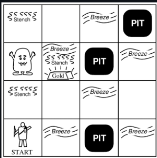
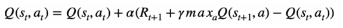
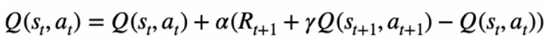

# AI_Reinforcement_Learning

Reinforcement learning merupakan salah satu jenis machine learning dimana suatu agent melakukan aksi terhadap lingkungannya, kemudian agent akan menerima reward atau penalty terhadap aksi yang telah dilakukannya. Tujuan akhir dari interaksi tersebut adalah membuat agent berperilaku sedemikian sehingga dapat memaksimalkan reward yang diterima.

Repository ini akan mengimplementasikan Q-Learning dan SARSA dari stratch untuk Environment Wumpus World. 
## Wumpus World


Permainan ini bertujuan mengambil emas dan kembali ke titik semula untuk climb sambil menghindari Wumpus dan Lubang di Board.

Cara Penggunaan Program : 
## Cara Menjalankan Program (Windows)
1. Clone Repository 
```sh
git clone https://github.com/salmaanhaniif/AI_Reinforcement_Learning.git
```
2. Buka terminal lalu pindah ke direktori
```sh
cd ./AI_Reinformencement_Learning
cd src
```
3. Untuk menjalankan notebook langsung saja buka main.py dan jalankan kodenya untuk melihat agent dengan metode Q-Learning dan SARSA

## Q-Learning dan SARSA
Algoritma Q-Learning dan SARSA memiliki fundamental policy yang masih sama, 
yaitu dengan mengacu kepada Q-Table dalam pengambilan keputusan. 
Keduanya bekerja dengan mengolah dan memperbarui Q-table nya sendiri,  
dengan menyimpan nilai untuk setiap state-action pair. Policy ini didasari oleh 
reward numerik yang didapat agent pada setiap action di state tertentu. Proses 
pembaharuan dari Q-Table oleh agent itu sendiri bertujuan untuk menghasilkan 
policy yang optimal di lingkungan yang tidak diketahui

Perbedaan fundamental dari on-policy (Sarsa) dan off-policy (Q-Learning) 
adalah pada metode pembelajaran dan pembaharuan Q-Table-nya, yaitu apakah 
mereka memperhitungkan kebijakan yang sedang dimiliki saat ini atau tidak.
 Sarsa menggunakan policy yang dimiliki saat ini untuk memperbarui nilainya 
(belajar&mempertimbangkan tindakan yang benar-benar akan diambil), 
sedangkan Q-Learning tidak, dia mempelajari tindakan optimal/terbaik yang bisa 
diambil di masa depan, terlepas dari aksi yang benar-benar diambil.

 Secara bahasa mungkin membingungkan saat dibaca, tapi dengan rumus 
matematis Q-Table berikut dapat lebih mudah dipahami.

*Q-Learning*



*Sarsa*


Sarsa memperbarui nilai Q-Table dengan mempertimbangkan action yang 
diambil di step selanjutnya (at+1) (next action diambil didasari Q-Table saat ini), 
sedangkan Q-Learning mengambil nilai max / optimal yang tersedia di next step. 
Jadi bisa dikatakan Q-Learning lebih optimis dan cepat, sedangkan Sarsa lebih 
konservatif
